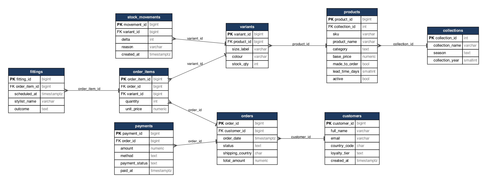

# Portfolio 1: Database Design and Modelling

## 1. My case study: Atelier Verane

I chose a simulated organisation called Atelier Verane, a made-to-order luxury fashion house that sells online to clients in 12 countries. All the data is synthetic, so no real people or companies are involved.

| Item | My statement |
|---|---|
| Organisation and scenario | Atelier Verane sells ready-to-wear and bespoke pieces in seasonal collections (gowns, coats, dresses, tailoring, knitwear, accessories). |
| Nature of the system | Some pieces are held in stock by size and colour. Others are made to order, so they carry a production lead time and one or more fittings before shipping. |
| Users of the database | Clients using the web shop, a checkout service, stylists running fittings, finance analysts and managers. |
| Major data stored | Clients, collections, products, size and colour variants with stock, orders and order lines, payments, fittings, and a stock movement log. |
| Key operations | Place an order and reserve stock, take payment, schedule fittings, report revenue by month and country, find top clients and best sellers, and keep stock correct when two people buy at once. |

I picked this scenario because a limited edition piece with one unit left creates the situations this module is about: two buyers at once (transactions), heavy reporting (optimisation), products with very different attributes (document model), carts and sessions (key-value) and clients in many countries (replication and security).

## 2. Entity relationship model

Figure 1 was generated from the live PostgreSQL catalogue by `03_generate_er_diagram.py`, so it always matches the real schema. The crow's foot marks the "many" side.

| Relationship | Cardinality | Meaning |
|---|---|---|
| collections to products | 1 : N | A collection contains many pieces. |
| products to variants | 1 : N | A piece comes in several sizes and colours, and stock is kept per variant. |
| customers to orders | 1 : N | A client orders many times. |
| orders to order_items | 1 : N | An order has one to three lines in my data. |
| variants to order_items | 1 : N | The same variant can be on many orders. |
| orders to payments | 1 : N | An order can have several payment attempts. |
| order_items to fittings | 1 : N | A made-to-order line can need several fittings. |
| variants to stock_movements | 1 : N | Every stock change is logged. |

Orders and variants are many-to-many, so I resolved that with `order_items`, which also holds `quantity` and `unit_price`.

## 3. Keys and constraints (`01_schema.sql`)

* Primary keys are surrogate `BIGINT GENERATED ALWAYS AS IDENTITY` keys, so they are never reused or overwritten by accident.
* Candidate keys are protected with `UNIQUE`: e-mail, SKU, collection name, (product, size, colour) and (order, variant).
* Foreign keys cover every relationship. I used `ON DELETE CASCADE` only where a child has no meaning without its parent (variants, order lines, fittings). Orders and payments have no cascade, so financial records cannot disappear silently.
* CHECK constraints cover the domains: `stock_qty >= 0`, `quantity > 0`, `base_price > 0` and fixed lists for status, season, category, tier and payment method. The non-negative stock rule is what stops overselling at database level, and I use it again in Portfolio 3.

## 4. Normalisation

I started from the kind of flat sheet a small atelier might keep:
`(order_id, order_date, client_name, client_email, client_country, product_sku, product_name, collection, season, size, colour, qty, price, payment_method)`

| Normal form | Problem in the flat sheet | What I did |
|---|---|---|
| 1NF | An order with several pieces repeats rows or crams values into one cell. | One row per order line, every value atomic. |
| 2NF | Client details depend only on the client, and product name only on the product, so they depend on part of the key. | Split into `customers`, `products`, `variants` and `collections`. |
| 3NF | `season` depends on the collection, not on the product (product to collection to season). | Moved season and year into `collections`. |
| BCNF check | I checked that each determinant is a candidate key, for example `sku` to `product_id` and `email` to `customer_id`. | No further split needed. |

### Redundancy I kept on purpose

| Column | Why I kept it |
|---|---|
| `order_items.unit_price` | It is the price the client actually paid, so it must not change when the price list changes. |
| `orders.total_amount` | I could derive it from the lines, but storing it saves summing on every dashboard query. Portfolio 3 keeps it correct inside the order transaction. |
| `orders.shipping_country` | A client can ship a gift abroad, so this belongs to the order and is not derivable from the client. |

## 5. Data volume

12 collections, 240 products, 2,400 variants, 20,000 clients, 120,000 orders, 240,000 order lines, about 94,000 payments and 57,000 fittings. The seed uses `setseed`, so the numbers are repeatable. I wanted enough rows for the execution plans to differ between "no index" and "index".

## 6. References

* Silberschatz, A., Korth, H.F. and Sudarshan, S. (2020) *Database System Concepts*. 7th edn. New York: McGraw-Hill Education.
* PostgreSQL Global Development Group (2024) *PostgreSQL 16 Documentation: Constraints*. Available at: https://www.postgresql.org/docs/16/ddl-constraints.html
* Obunadike, G.N. (2026) *Features of Advanced Database Systems* [Lecture slides, MIT 8103 S2_01]. Miva Open University.
